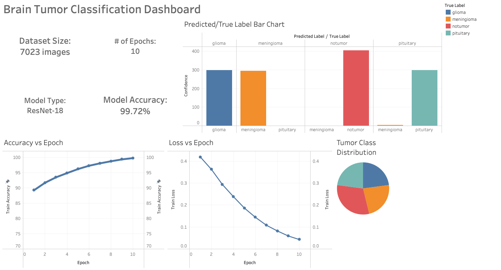

#  Brain Tumor Classification with ResNet18

This project leverages deep learning to classify brain tumors from MRI images into four distinct classes: **Glioma**, **Meningioma**, **Pituitary**, and **No Tumor**. It uses a ResNet18-based convolutional neural network trained on a publicly available dataset from Kaggle and visualizes results using Tableau.

---

##  Dataset

- Source: [Kaggle Brain Tumor Dataset](https://www.kaggle.com/datasets/masoudnickparvar/brain-tumor-mri-dataset)
- Total Images: 7,023 MRI scans
- Classes:
  - **Glioma**
  - **Meningioma**
  - **Pituitary**
  - **No Tumor**

---

##  Model

- Architecture: **ResNet18**
- Training Time: **10 epochs**
- Final Accuracy: **99.72%**

The model was trained using PyTorch with data augmentation, cross-entropy loss, and standard training-validation splitting.

---

##  Tableau Dashboard

The results of the model are visualized in an interactive **Tableau dashboard** showing:

- 📌 Prediction vs True Label counts (Bar chart)
- 🧠 Accuracy and loss over epochs
- 🔍 Model type and final test accuracy (KPIs)
- 📊 Tumor class distribution
- ✅ Number of records and correctly predicted samples

---

##  Files Overview

| File | Description |
|------|-------------|
| `train.py` | Trains the ResNet18 model |
| `dataset.py` | Custom PyTorch dataset loader |
| `createcsv.py` | Creates `predictions.csv` from test results |
| `predictions.csv` | CSV containing `filename`, `true_label`, `predicted_label`, and `confidence` |
| `gradcam.py` | Grad-CAM implementation for model explainability |
| `testgradcam.py` | Script to generate Grad-CAM heatmaps |
| `gradcam_result.jpg` | Sample visualization of Grad-CAM output |
| `Dashboard.png` | Final Tableau dashboard export |
| `README.md` | Project documentation |

---

